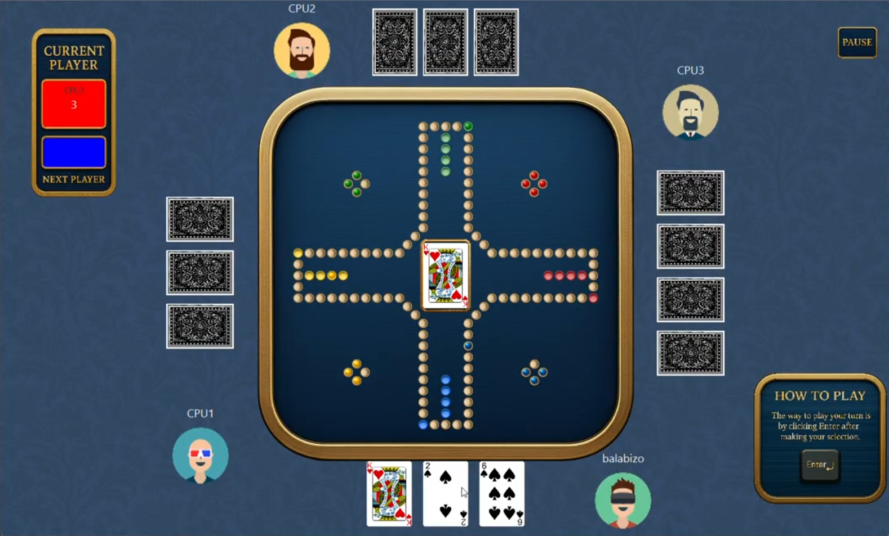

# Jackaroo: A New Game Spin

This repository contains a single-player digital adaptation of the strategic board game Jackaroo. The game pits one human against three CPU opponents with customized rules and card mechanics.

## Features
- Custom game logic: 15 unique card types drive movement, swapping, and marble elimination.
- Dynamic board: 100-cell track with eight Trap Cells that relocate whenever a marble is destroyed.
- Single-player focus: Human vs. three automated CPU opponents that manage turn-based actions and strategy.
- Specialized zones: Home Zones, Base Cells, and Safe Zones with specific immunity and movement rules.

## Technical Architecture
- MVC pattern: Separates core game logic (Model), rendering/input (View), and orchestration (Controller).
- OOP model layer: Encapsulates game entities such as the 102-card deck and player state management.
- UI framework: JavaFX-based interface for interactive board visualization and hand management.

## How to Play
- Objective: Move all four marbles from your Home Zone into your Safe Zone before the CPUs do.
- Fielding: Use an Ace or King to move a marble from the Home Zone to the Base Cell.
- Movement: Play cards to advance marbles clockwise along the track.
- Strategy: Use special cards like the Burner or Jack to disrupt opponents by sending marbles home or swapping positions.

## Media
- Gameplay video: [Watch here](https://drive.google.com/file/d/10FtyhjtI2Int_aH2nBxK8FNUywrGpFGJ/view?usp=drive_link).
- Gameplay screenshot:

	
